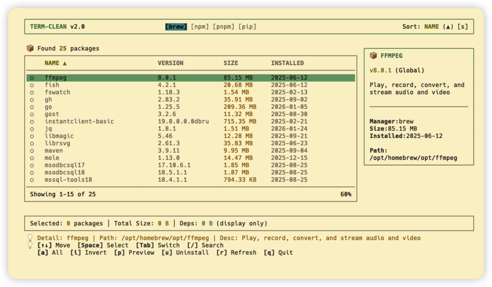
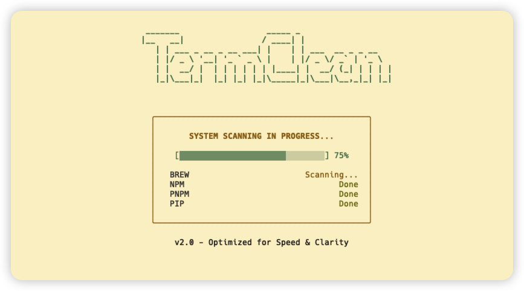
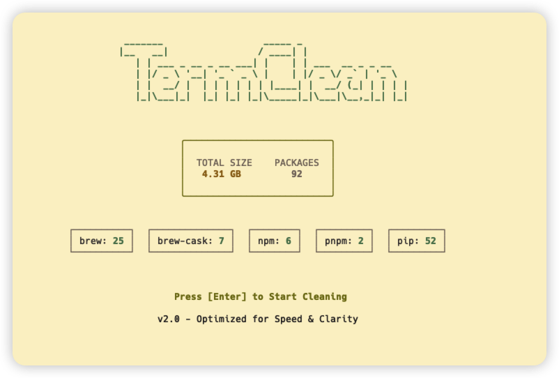

# term-clean


`term-clean` 是一个专为 macOS 用户设计的终端 TUI（命令行图形界面）清理工具，旨在帮助您轻松管理、分析和清理各种包管理器（brew, npm, pnpm, yarn, pip）安装的软件包。


## 🎯 为什么需要 Term-Clean？

如果您遇到以下场景，Term-Clean 将是您的得力助手：

- **"由于开发需求安装了大量工具，现在磁盘空间告急，想清理却不知从何下手..."**
  > 📊 Term-Clean 提供直观的空间占用分析，让您一眼识别"吃灰"的大文件。

- **"担心卸载 `ffmpeg` 会导致其他依赖它的工具无法运行..."**
  > 🛡️ 独创的依赖树分析与卸载预览功能，确保您清楚每一次操作的影响范围。

- **"按照教程装了一堆包，教程结束后却不敢删..."**
  > 🔍 清晰展示每个包的来源与用途，告别"盲装盲删"的焦虑。

## 🌟 核心特性

- 📦 **多管理器支持**：一站式管理 Homebrew (Formulae & Casks), npm, pnpm, yarn 和 pip。
- 🔍 **智能扫描与分析**：自动检测所有已安装的包，并分析其占用的磁盘空间。
- 🌳 **依赖追溯**：内置递归依赖树构建算法，清晰展示包与包之间的引用关系。
- ⚠️ **安全卸载预览**：在执行卸载前，系统会进行二次确认并显示受影响的依赖项，防止误删系统关键组件。
- ⌨️ **纯键盘交互**：基于 Ink 和 React 构建，提供流畅的 TUI 操作体验。
- 📊 **实时统计**：实时计算选中包的总大小以及可释放的磁盘空间。
- 🆙 **自动更新检测**：后台静默检查所有包的可用更新，并提供可视化指示器。
- 👁️ **包监控功能**：监视特定包的更新状态，跨会话持久化监控列表。
- ⚡ **一键升级**：一键将选中的包升级到最新版本。
- 🔤 **智能排序**：支持按名称、大小或安装日期排序，带可视化方向指示器。
- 🔎 **实时搜索**：增量搜索快速过滤包，支持大小写不敏感匹配。
- ✨ **批量操作**：全选、反选、批量监控等高效包管理功能。



## 🚀 快速开始

### 快速体验

您可以使用 `npx` 直接运行（无需安装）：

```bash
npx term-clean
```

或者进行全局安装：

```bash
npm install -g term-clean
```

### 本地开发

如果您想参与开发或运行源码：

1. **克隆仓库**
   ```bash
   git clone https://github.com/daijinhai/TermClean.git
   cd TermClean
   ```

2. **安装依赖**
   ```bash
   npm install
   ```

3. **运行方式**

   **方式 A：开发模式（推荐用于开发调试）**
   ```bash
   npm run dev        # 启动 watch 模式
   node dist/cli.js   # 在另一个终端运行
   ```

   **方式 B：构建运行（推荐用于完整测试）**
   ```bash
   npm run build
   npm start
   ```

   **方式 C：全局命令（推荐用于日常使用）**
   ```bash
   npm link           # 链接到全局
   term-clean         # 之后可直接使用
   ```

### 使用方法

#### 交互模式 (TUI)

直接运行命令即可进入交互式界面：

```bash
term-clean
```

进入界面后，您可以使用以下快捷键：

### 导航与选择
- `↑/↓`：在包列表中上下移动。
- `Tab` / `Shift+Tab`：在不同的包管理器标签页（brew, npm, pip 等）之间切换。
- `空格键`：勾选/取消勾选包。
- `Enter`：查看高亮包的详细信息。

### 包操作
- `p`：预览模式 - 查看选中包的详细信息及卸载影响分析。
- `u`：快速卸载 - 跳过预览直接卸载选中的包（需确认）。
- `g`：将选中的包升级到最新版本。
- `w`：切换高亮包的监控状态（监视更新）。
- `W`：批量监控 - 将所有选中的包加入监控列表。
- `v`：切换高亮包的更新检查状态。

### 批量操作
- `a`：全选/取消全选当前视图中的所有包。
- `i`：反选。

### 排序与过滤
- `s`：循环切换排序方式（名称 → 大小 → 日期）。
- `/`：进入搜索模式，按包名过滤。
- `Esc`（搜索模式下）：退出搜索并清除过滤。

### 系统操作
- `r`：刷新扫描结果。
- `q`：退出应用。
- `c`（预览模式下）：确认并执行卸载。



### 🎨 视觉指示器

界面使用直观的图标帮助您快速了解包的状态：

- **👁️** - 正在监控的包（监视更新）
- **🆙** - 有可用更新（显示当前版本 → 最新版本）
- **▲/▼** - 排序方向指示器（升序/降序）
- **◉** - 已选中的包
- **○** - 未选中的包

### 🔄 智能功能

**自动更新检测**：Term-Clean 会在后台静默检查包的可用更新。当发现更新时，包会被标记为 🆙 并显示版本升级路径（例如 `1.0.0 → 1.0.1`）。

**包监控功能**：使用 `w` 键将常用包添加到监控列表。被监控的包会高亮显示，更新状态会跨会话持久化保存。

**智能排序**：按 `s` 键循环切换不同的排序方式：
- **按名称**（A-Z 或 Z-A）
- **按大小**（从大到小或从小到大）
- **按安装日期**（最新或最旧优先）

**搜索与过滤**：按 `/` 键进入搜索模式，输入关键词即可实时过滤包。搜索不区分大小写，匹配包名。

#### 命令行模式 (CLI)

您也可以使用传统的命令行参数：

```bash
# 仅过滤特定的包管理器
term-clean -m brew

# 以调试模式启动（查看详细日志）
term-clean --debug
```

## 🛠️ 开发与测试

### 环境准备

- Node.js (建议 v18+)
- npm / pnpm / yarn

### 测试

项目使用 `vitest` 进行单元测试：

```bash
# 运行所有测试
npm test

# 运行单元测试
npm run test:unit
```

## 🏗️ 架构设计

项目采用分层架构，保证了良好的可扩展性和可维护性：

- **Managers (适配器层)**：统一了不同包管理器的查询和卸载接口（如 `BrewPackageManager`, `NpmPackageManager` 等）。
- **Services (业务逻辑层)**：处理包扫描 (`PackageScannerService`) 和清理流程 (`PackageCleanerService`)。
- **Stores (状态管理)**：使用 `zustand` 管理全局响应式状态（如选中的包、列表数据等）。
- **Components (UI层)**：基于 `ink` 构建的 React 组件库，负责 TUI 界面的渲染。

## 📅 路线图 (Roadmap)

### 已完成 ✅
- [x] 多包管理器适配器实现
- [x] 递归依赖分析算法
- [x] 核心 TUI 界面与键盘交互
- [x] 卸载预览与风险预警
- [x] 自动更新检测功能
- [x] 包监控与监控列表
- [x] 一键升级包功能
- [x] 智能排序（按名称、大小、日期）
- [x] 实时搜索与过滤
- [x] 批量操作（全选、反选、批量监控）
- [x] 优化的异步加载与静默后台更新

### 进行中 🚧
- [ ] 导出清理日志到文件
- [ ] 软件包使用频率追踪（智能识别长期未使用的包）
- [ ] 增强的正则过滤功能
- [ ] 依赖树的图形化可视化展示
- [ ] 配置文件支持持久化设置
- [ ] 插件系统支持自定义包管理器

## 📄 开源协议

本项目基于 MIT 协议开源。

## 🤝 贡献

欢迎提交 Issue 或 Pull Request！如果您觉得这个工具有用，请给它一个 ⭐️。
